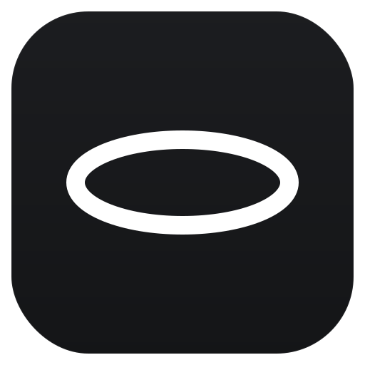

<p align="center">
  
</p>

<h1 align="center">Halo</h1>

<p align="center">A native macOS terminal for running AI coding agents in parallel —<br>built on real <a href="https://ghostty.org">libghostty</a>, driven by a scriptable CLI.</p>

---

Halo is a Swift/AppKit terminal that links **GhosttyKit.xcframework** (it is not
a Ghostty fork). It renders with Ghostty's Metal engine, reads your existing
`~/.config/ghostty/config` as-is, and adds a project sidebar, tmux-style splits,
and an agent-control CLI on top.

## Highlights

- **Real libghostty** — Ghostty 1.3.2 Metal renderer, your ghostty config and
  theme, zero reimplemented terminal logic.
- **Projects → sessions sidebar** — vertical, drag-resizable. Each project owns
  sessions; rename / recolor / remove from the right-click menu.
- **Native splits** — `⌘D` / `⌘⇧D`, click-to-focus, zoom, drag dividers.
- **Scriptable** — the `halo` CLI drives and reads the live UI over a Unix
  socket, so agents can orchestrate it.
- **Everything from your config** — colors, fonts, sidebar width, divider width
  are all `halo-*` keys in the same ghostty config file. Empty config = sane
  defaults.

## Build & run

```sh
swift build
.build/arm64-apple-macosx/debug/halo            # run the app
swift run halo selfcheck                          # pure-logic checks
./install.sh                                      # symlink `halo` → /usr/local/bin
```

> The debug binary is bundle-less and dies if its launching shell exits — use
> `nohup .build/.../halo & disown`, or build an `.app` bundle, for a detached run.

## The `halo` CLI

Drives the running app over `~/Library/Application Support/halo/control.sock`.
`halo help` is authoritative; the common verbs:

```sh
halo help                       # list every verb + config key
halo open <path>                # new session at <path>
halo split -v | -h              # split the focused pane (side-by-side / stacked)
halo new-pane --cwd <path>      # new pane in a dir
halo focus <id> | halo focus next
halo zoom                       # toggle zoom on the focused pane
halo close                      # close the focused pane
halo send-keys <target> <text>  # type into a pane (target = pane id or "focused")
halo capture                    # dump the focused pane's screen
halo list                       # JSON: sessions + panes + focus
halo tab new|next|prev|<n>      # session control
```

## Configuration

Halo reads `halo-*` keys from your ghostty config (libghostty ignores them).
Standard ghostty keys (`theme`, `background`, `foreground`, `cursor-color`,
`palette = N=#hex`) apply live. Every `halo-*` default matches the built-in
look, so an untouched config changes nothing.

| Key | Default | Meaning |
|-----|---------|---------|
| `halo-accent` | theme accent | accent color (rings, dots, focus ticks) |
| `halo-surface` | theme background | base surface color |
| `halo-sidebar-width` | 240 | sidebar open width (px) |
| `halo-font-family` | Geist Mono | chrome label font |
| `halo-font-mono` | Martian Mono | mono font |
| `halo-font-size` | 13 | chrome font size |
| `halo-divider-width` | 8 | split divider grab width (1px hairline drawn) |
| `halo-projects` | — | comma-separated project paths to preload |

## Keybindings

| Keys | Action |
|------|--------|
| `⌘D` / `⌘⇧D` | split vertical / horizontal |
| `⌘W` / `⌘⇧W` | close pane / close session |
| `⌘T` | new session in active project (cwd `~`) |
| `⌘]` | focus next pane |
| `⌘{` / `⌘}` | previous / next session |
| `⌘1`–`⌘9` | select session N |
| `⌘B` | toggle sidebar |

Click a pane to focus it; click a project to expand it; right-click a project
to rename / recolor / remove it.

## Architecture

- `Sources/Halo/Ghostty/` — libghostty init, config sync, runtime callbacks.
- `TerminalPane.swift` — a ghostty surface (input / IME / mouse / resize / cwd / title).
- `PaneTree.swift` — tmux-style splits as nested `NSSplitView`s.
- `Tabs.swift` — the `Workspace` model: projects own sessions.
- `Chrome.swift` — window, titlebar, sidebar rendering.
- `Control.swift` — the `halo` CLI + socket server.
- `GhosttyConfig.swift` — `Theme` + `HaloConfig` (the `halo-*` keys).
- `Git.swift` — branch / status, shelled out off-main.

## Roadmap

Designs live in `docs/superpowers/specs/`. In progress: **cmux parity**
(`2026-06-22-cmux-parity-design.md`) — git-worktree-isolated sessions, attention
rings, richer sidebar (ports + dirty state), and an embedded browser pane.
Deferred: OS-level notifications.

## Self-checks

```sh
.build/arm64-apple-macosx/debug/halo selfcheck   # config, control, git, workspace, chrome
```
