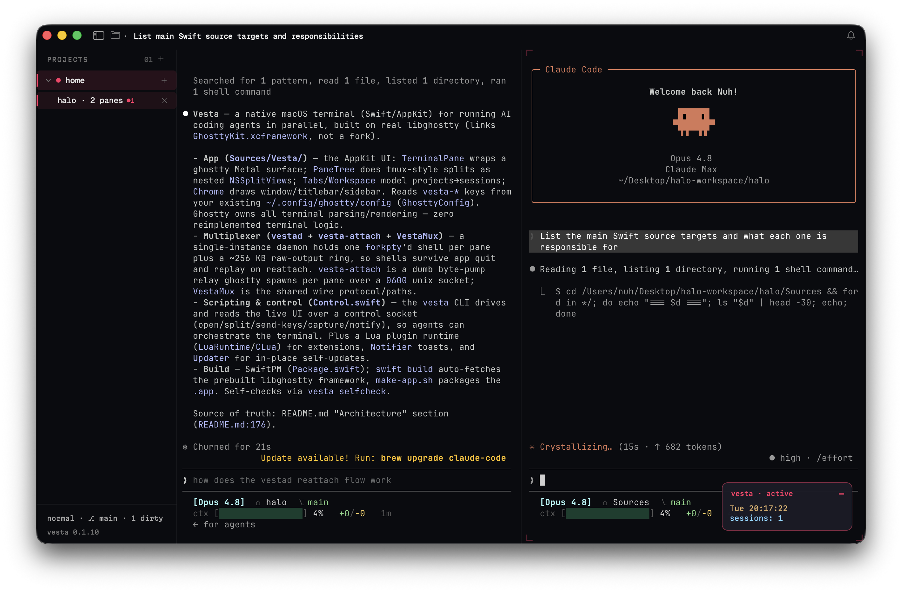

<p align="center">
  
</p>

<h1 align="center">Vesta</h1>

<p align="center">A native macOS terminal for running AI coding agents in parallel —<br>built on real <a href="https://ghostty.org">libghostty</a>, driven by a scriptable CLI.</p>

<p align="center">
  <a href="https://github.com/vestaterm/Vesta/releases/latest"><b>Download</b></a> ·
  <a href="https://vestaterm.github.io/vesta-site/">Website</a> ·
  <a href="https://vestaterm.github.io/vesta-site/docs.html">Docs</a> ·
  <a href="https://vestaterm.github.io/vesta-site/assets/vesta-demo.mp4">▶&nbsp;Watch&nbsp;the&nbsp;tour</a>
</p>

<p align="center">
  
</p>

---

Vesta is a Swift/AppKit terminal that links **GhosttyKit.xcframework** (it is not
a Ghostty fork). It renders with Ghostty's Metal engine, reads your existing
`~/.config/ghostty/config` as-is, and adds a workspace sidebar, tmux-style splits,
and an agent-control CLI on top.

## Install

```sh
brew install --cask vestaterm/tap/vesta-terminal
```

Installs the signed + notarized app plus the `vesta` CLI on your PATH. Upgrades come
via `brew update && brew upgrade --cask vesta-terminal --greedy` (the cask is marked
`auto_updates`, so plain `brew upgrade` defers to it) or the app's built-in updater. Prefer a plain
download? Grab the DMG from the [latest release](https://github.com/vestaterm/Vesta/releases/latest).

## Highlights

- **Real libghostty** — Ghostty's Metal renderer, your ghostty config and
  theme, zero reimplemented terminal logic.
- **Persistent sessions (tmux-style)** — shells survive Vesta quitting and
  reattach cleanly. A small daemon (`vestad`) holds the PTYs; panes connect
  through a relay (`vesta-attach`). Prefix-key mode for tmux muscle memory.
  Restore is lazy: at launch only the visible workspace reattaches; the rest
  stay listed in the sidebar and attach instantly on first click, so a big
  saved sidebar opens fast. Until a restored workspace is first activated it
  won't ring the attention dot (its shell keeps running under the daemon
  regardless, and plugin `pane-output` taps still work).
- **Workspace sidebar** — one flat, drag-resizable list. Each row is a
  **workspace**: one terminal session rooted at a directory, with splits inside
  it (one workspace is also one "tab" to the CLI). The titlebar **+** (or `⌘T`)
  makes one instantly at the active workspace's cwd — no folder picker.
  **Groups** are visual only — a collapsible header with a name, a color and a
  member count, no directory and no behavior of its own. Drag to reorder anywhere
  (top level, or within a group); drop an **ungrouped** top-level row onto a group
  header to join it — a row that's already in a group moves via its context menu
  (Move to group / Remove from group). Right-click for rename / color / new group from
  workspace / move to group / close, or a header for rename / color / ungroup /
  remove. The order persists across restarts.
- **Workspace cards** — each card shows an output tail (the last ~4 rendered
  lines of its focused pane, Claude Code-aware: anchored on the last `⏺` block,
  input-box chrome filtered), pane counts (`⊞N`, or the real split topology — nested ratios, focused pane lit — with
  `vesta-sidebar-panes`), and **heat**: an unseen failure flips the card amber
  with `✗` + how long ago, an unseen success gets a `✓` — driven by OSC 133
  marks, which Vesta injects into zsh out of the box (`vesta-shell-integration`);
  the bell/attention rail stays brightest. Actions like close reveal on hover —
  no always-visible close buttons.
- **Glass** — ephemeral chrome (command palette, confirms, toasts) always
  renders on native blur ("glass moments"). Opt in further with
  `vesta-glass-sidebar` (translucent sidebar, surface color as tint,
  `vesta-sidebar-opacity` for strength) and ghostty's own `background-opacity`
  for terminal translucency — two independent knobs, each with a matching
  titlebar band.
- **Native splits** — `⌘D` / `⌘⇧D`, click-to-focus, zoom, drag dividers.
- **Command palette** — `⌘⇧P` opens a searchable list of every action (splits,
  sessions, browser pane, settings…) plus your plugins' `vesta.command` entries,
  auto-scaling as you filter.
- **Default terminal** — **Vesta ▸ Make Vesta the Default Terminal** registers
  it as the Shell-role handler for unix executables (the same mechanism as
  Ghostty/iTerm2).
- **Drag & drop** — drop files onto a pane and their paths insert shell-escaped,
  space-separated (Terminal.app behavior); dropped text inserts as-is.
- **Scriptable** — the `vesta` CLI drives and reads the live UI over a Unix
  socket, so agents can orchestrate it.
- **Notifications** — `vesta.notify` from a plugin shows a stacking in-app toast,
  records it in a titlebar **bell** (history persists across restarts), and posts
  a macOS Notification Center banner when Vesta is backgrounded (or when forced).
- **Self-updating** — when a newer release exists, a badge appears at the sidebar
  bottom; click it to download, install (in place), and relaunch — no manual DMG.
- **Pick your app icon** — **Settings ▸ App Icon** swaps between a clean white
  flame, a pink one, and ten progressively "corrupted" stages (or click the icon
  in the About panel to cycle them). The choice is written onto the `.app` bundle,
  so it sticks in Finder/Dock across quits and survives in-place updates.
- **Everything from your config** — colors, fonts, sidebar width, divider width
  are all `vesta-*` keys in the same ghostty config file. Empty config = sane
  defaults.

## Build & run

No setup needed — `swift build` fetches the prebuilt GhosttyKit framework
(libghostty) automatically via a checksum-verified release asset.

```sh
swift build                                       # auto-fetches GhosttyKit on first build
.build/arm64-apple-macosx/debug/vesta            # run the app (dev)
swift run vesta selfcheck                          # pure-logic checks
./install.sh                                      # copy vesta + vestad + vesta-attach → /usr/local/bin (CLI)

./make-app.sh                                     # build Vesta.app (double-clickable, logo icon)
open Vesta.app                                     # launch the bundle
```

> The raw debug binary is bundle-less and dies if its launching shell exits (use
> `nohup .build/.../vesta & disown`). **`./make-app.sh`** packages a proper
> `Vesta.app` — logo dock icon, "Vesta" menu, double-click launch, detached
> lifetime. The binary is self-contained (ghostty is statically linked).

## The `vesta` CLI

Drives the running app over `~/Library/Application Support/vesta/control.sock`.
`vesta help` is authoritative; the common verbs:

```sh
vesta help                       # list every verb + config key
vesta open <path>                # new workspace at <path>
vesta ws new [PATH] [--name X]   # new workspace (PATH defaults to the dir you ran it in)
vesta ws rename <name> | ws color <#hex|none> | ws close    # act on the active workspace
vesta group new [name]           # wrap the active workspace in a group (named after it by default)
vesta group rename <name> | group color <#hex|none> | group ungroup | group remove
vesta select <n>                 # switch to workspace n (0-based, flat sidebar order)
vesta rename <name>              # rename the active workspace (blank clears it)
vesta split -v | -h              # split the focused pane (side-by-side / stacked)
vesta new-pane --cwd <path>      # new pane in a dir
vesta focus <id> | vesta focus next
vesta zoom                       # toggle zoom on the focused pane
vesta close                      # close the focused pane
vesta send-keys <target> <text>  # type into a pane + run it (target = pane id or "focused"; --no-enter to skip the Return)
vesta send-keys --all|--session <N>|--project <name> <text>   # broadcast: active workspace's panes / workspace N (or legacy P.S) / every workspace in group <name> — a bare row answers to its own name (reply: pane count)
vesta capture                    # dump the focused pane's screen
vesta pane status <paneID>       # JSON for one pane: cwd, title, alive, attention, workspace (flat index) + legacy "P.S" session, project/group
vesta list                       # the active workspace's panes (+ tab index/count)
vesta tab new|next|prev|close    # tab control (one workspace = one tab)
vesta sessions [--json] [--project <name>]   # list workspaces; --json for structured records (id, workspace, name, project, panes, active/attention, cwd when the row reports one; --project implies --json)
vesta state                      # workspaces + groups + windows as JSON (plus a `projects` compat view)
vesta kill <id>                  # end a workspace's shell (by paneID)
vesta notify [--desktop] [--title <t>] <msg>   # toast + bell; desktop banner when backgrounded (--desktop forces)
```

**Legacy compat.** `vesta project rename|remove|color` still works: it acts on the
active row's **group** when it has one, else on the workspace itself. `project new`
is `ws new`; `project dir` is gone (each workspace owns its cwd — `cd` in the shell)
and returns an error saying so. `select <project> <session>` still resolves through
the top-level rows (a group is one unit, its members are that unit's sessions), and
`sessions --json` keeps reporting that pair as the string `id` alongside the flat
`workspace` index — `select` takes either.

## Workspaces & groups

One sidebar row = one **workspace** = one terminal session rooted at a directory,
with splits inside it — and one workspace is also one "tab" as far as `vesta tab`
is concerned. There is no project layer: a workspace owns its cwd,
and `+` / `⌘T` opens a new one at the active workspace's cwd immediately (no
picker). Its default name is the directory basename; `⌃B ,` or `vesta rename`
overrides it, and per-workspace / per-group colors come from the right-click menu.

**Groups** are packaging, nothing more — name, color, collapse, member count. They
have no directory, can't be empty (the last member leaving deletes the group), and
`Ungroup` keeps every workspace while `Remove Group…` closes them (with a confirm).

**Persistence.** The sidebar lives in `windows.json` (format **v2**: per-window
`groups` + flat `workspaces` + `activeWorkspace` + frame; array order *is* sidebar
order). Older files auto-migrate on launch, preserving order: a project with one
session becomes a workspace keeping the project's name and color, a project with
two or more becomes a group holding its sessions, and a never-opened config project
becomes a dormant workspace at its path. The pre-migration file is kept once as
`windows.json.v<old version>` in case you downgrade. `projects.json` is retired.

`vesta-projects = ~/a, ~/b` seeds each path as a **dormant** workspace row at the
end of the list — clickable, costing no shell until you click it. A path that isn't
an existing directory is skipped, and a row already seeded from that path (tracked
by provenance, so `cd`-ing out of it doesn't matter) is never seeded twice.

## Multiplexer & sessions

Shells run under a small daemon (`vestad`), not the app, so they **survive Vesta
quitting** and **reattach cleanly**. The daemon owns one `forkpty`'d shell per
pane and keeps the last ~256 KB of its raw output; on attach it replays those
bytes and ghostty re-renders them — colors, cursor, full-screen apps and all
(no separate screen model, so nothing to garble). On by default; set
`vesta-persist = false` for plain non-persistent shells.

What you get:

- **Survive quit** — `⌘Q`, reopen Vesta: panes come back with their shells and
  recent output.
- **Close ends the shell** — `⌘W` cascades: it closes the focused pane **and
  kills its shell**, or with one pane left closes the workspace (killing its
  shells), or with one workspace left closes the window — and *that* last step
  keeps the shells, so they reattach on relaunch. `⌘⇧W` always closes and kills
  the workspace. Closing a pane drops it from the sidebar too, so a shell left
  running there would be unreachable forever — anything it still held (a dev
  server's port, for one) would leak. Shells survive only across window-close /
  `⌘Q` quit. To keep a shell but drop the pane, prefix-`d` (detach) — note it
  needs a second pane to detach from, since a workspace always keeps one.
- **Survive reboot (cold restore)** — a reboot kills every pty, so there is
  nothing to reattach to. The workspace still comes back under its own name, in
  its sidebar position, with its split layout rebuilt and a **fresh shell in the
  saved directory**; the on-disk scrollback replays above it as inert history,
  followed by a dim divider:
  `── vesta: session restarted — new shell in <dir> ──`. This needs
  `vesta-persist-scrollback` (**on by default** — see Configuration for the
  privacy trade-off and how to opt out). An ordinary quit/relaunch with the
  daemon still alive is unchanged: it reattaches to the live shells, no divider.
- **Prefix mode** — tmux muscle memory. Press the prefix (`ctrl+b` by default,
  `vesta-prefix`), then a key (table below). Empty `vesta-prefix` disables it.
- **Explicit kill** — prefix-`x`, or `vesta kill <id>` — when you actually mean
  to end the shell.

### Verify it works

```sh
# 1. survive quit
#    in a pane:   echo i-was-here && date
#    ⌘Q, reopen Vesta.app → the pane shows that output again.

# 2. detached sessions survive
#    close the window (not ⌘⇧W) → its shells keep running; relaunch → they reattach.
#    or prefix-d a pane to detach it (shell lives on under vestad).

# 3. reboot restore (with vesta-persist-scrollback on, the default)
#    reboot → reopen Vesta: each workspace is back in its saved dir with its old
#    history above a "── vesta: session restarted …" divider and a fresh prompt.

# 4. from the CLI, read the sidebar the daemon is holding up
vesta sessions            # one line per workspace, ▸ marks the active one
                          # "▸ [2] 1 1" → `select 2` (flat) or `select 1 1` (legacy pair)
vesta kill <id>           # ends one for real
```

If a pane ever says "daemon protocol … update Vesta", an **old `vestad` from a
previous build** is still running (`pkill -f vestad`, then relaunch) — the
daemon is single-instance per user.

### Prefix keytable (after `ctrl+b`)

| Key | Action | Key | Action |
|-----|--------|-----|--------|
| `%` | split vertical | `c` | new workspace |
| `"` | split horizontal | `n` / `p` | next / prev workspace |
| `h j k l` / arrows | focus pane | `,` | rename workspace |
| `z` | zoom pane | `d` | detach pane |
| `x` | kill shell |  |  |

Override bindings with `vesta-prefix-bind = key:action, …` in your ghostty config.

## Configuration

Vesta reads `vesta-*` keys from your ghostty config (libghostty ignores them).
Standard ghostty keys (`theme`, `background`, `foreground`, `cursor-color`,
`palette = N=#hex`) apply live. Every `vesta-*` default matches the built-in
look, so an untouched config changes nothing.

| Key | Default | Meaning |
|-----|---------|---------|
| `vesta-accent` | theme accent | accent color (rings, dots, focus ticks) |
| `vesta-surface` | theme background | base surface color |
| `vesta-sidebar-width` | 224 | sidebar open width (px) |
| `vesta-font-family` | GeistMono | chrome label font |
| `vesta-font-mono` | MartianMono | mono font |
| `vesta-font-size` | 13 | chrome font size |
| `vesta-divider-width` | 8 | split divider grab width (1px hairline drawn) |
| `vesta-projects` | — | comma-separated paths, each seeded as a dormant workspace row (skipped if the dir doesn't exist; never seeded twice) |
| `vesta-persist` | true | run shells under `vestad` (survive quit); `false` = plain shells |
| `vesta-lite` | false | lite mode: new windows (and the next launch) open ghostty-like — titlebar + terminal only, no sidebar/footer/workspaces; splits still work; shells are plain processes that **die when the window closes**. Your full workspace setup is untouched and returns when turned off. `⌥⌘N` opens a single lite window any time |
| `vesta-persist-scrollback` | true | mirror scrollback to disk (0600) so it survives a daemon restart — or a reboot, where the restored workspace gets a `── vesta: session restarted — new shell in <dir> ──` divider above its fresh prompt. `false` = opt out; terminal output can contain secrets (see [SECURITY.md](SECURITY.md)) |
| `vesta-sidebar-tails` | true | workspace cards show the last ~4 rendered lines of their focused pane (content-aware for TUI agents: anchors on Claude Code's last `⏺` block, filters its input box). Also gates background materialization of restored workspaces at launch |
| `vesta-sidebar-panes` | false | multi-pane cards draw their real split layout (focused pane highlighted); off = a dim `⊞N` count still shows |
| `vesta-link-hover` | true | URLs underline and the cursor turns into a hand when you point at one; `⌘`-click opens it. `false` = ghostty's own rule, where a link only lights up while `⌘` is held |
| `vesta-link-click` | cmd | which click opens the link under the pointer: `cmd` (⌘-click, ghostty's own rule), `double`, or `single`. A real ⌘-click opens in every mode; the looser modes stand down inside apps that grab the mouse (Claude Code, vim), which would otherwise see a press with no release |
| `vesta-glass-sidebar` | false | translucent sidebar — behind-window blur with the surface color as a tint; titlebar over the sidebar matches. Applies on relaunch |
| `vesta-sidebar-opacity` | 0.55 | sidebar tint strength in glass mode (0..1) |
| `vesta-shell-integration` | true | inject zsh OSC 133 marks into daemon-spawned shells so card heat (✓/✗) works out of the box; `false` = opt out |
| `background-opacity` | 1 | ghostty key (no `vesta-` prefix): terminal translucency, e.g. `0.9` — independent of the sidebar; the titlebar strip over the terminal matches the terminal's color and opacity |
| `vesta-prefix` | ctrl+b | prefix key for tmux-style mode; empty = disabled |
| `vesta-prefix-bind` | — | override prefix bindings: `key:action, …` |

## Keybindings

| Keys | Action |
|------|--------|
| `⌘D` / `⌘⇧D` | split vertical / horizontal |
| `⌘W` / `⌘⇧W` | close pane / close workspace |
| `⌘T` | new workspace at the active workspace's cwd (`$HOME` if there is none) |
| `⌘]` / `⌘[` | focus next / previous pane |
| `⌘{` / `⌘}` | previous / next workspace |
| `⌘1`–`⌘9` | select the Nth workspace (flat sidebar order — grouped rows count too) |
| `⌘B` | toggle sidebar |
| `⌘⇧P` | command palette (search + run any action or plugin command) |
| `⌘N` | new window (same sidebar and workspace pool; lite when `vesta-lite` is on) |
| `⌥⌘N` | new **lite** window — no sidebar, plain shell that dies on close (see `vesta-lite`) |
| `ctrl+b` then a key | prefix mode (see Multiplexer & sessions) |

Click a pane to focus it; click a group header to collapse or expand it.
Right-click a workspace to rename / recolor / group / close it, a group header
to rename / recolor / ungroup / remove it. `⌘W` closes the focused pane **and
kills** its shell; `⌘⇧W` closes **and kills** the whole workspace — see
Multiplexer & sessions.

## Architecture

- `Sources/Vesta/Ghostty/` — libghostty init, config sync, runtime callbacks.
- `TerminalPane.swift` — a ghostty surface (input / IME / mouse / resize / cwd / title).
- `PaneTree.swift` — tmux-style splits as nested `NSSplitView`s.
- `Tabs.swift` — the flat model: a shared `SessionStore` (workspaces + visual
  groups, array order = sidebar order) and a per-window `Workspace` view over it,
  plus `windows.json` (de)serialization and the v0/v1 → v2 migration.
- `Chrome.swift` — window, titlebar, sidebar rendering.
- `TailStore.swift` — cleaned per-pane output tails (ANSI-stripped, OSC 133
  exit marks parsed) feeding the workspace cards.
- `Glass.swift` — native-blur base for ephemeral chrome ("glass moments") and
  the glass sidebar.
- `Control.swift` — the `vesta` CLI + socket server.
- `GhosttyConfig.swift` — `Theme` + `VestaConfig` (the `vesta-*` keys).
- `Git.swift` — branch / status, shelled out off-main.
- `PrefixMode.swift` — tmux-style prefix mode.
- `Sources/vestad/` — the session daemon: one `forkpty`'d shell per pane + a raw
  output ring, replayed on attach. No terminal parsing (ghostty does that).
- `Sources/vesta-attach/` — the per-pane relay ghostty spawns as its command;
  a dumb byte pump between the pane and the daemon over a `0600` unix socket.
- `Sources/VestaMux/` — shared wire protocol (`MuxProtocol`) + paths (`MuxPaths`)
  + `ShellIntegration.swift` (the zsh OSC 133 injection, via a ZDOTDIR swap).

## Roadmap

Designs live in `docs/superpowers/specs/`. Shipped: **persistent sessions**
(`2026-06-25-mux-rawring-rewrite.md`) — `vestad`/`vesta-attach` raw-ring
multiplexer, prefix mode. Deferred there: mirroring (one session in two panes),
remote attach (`vesta attach ssh://`), and inline-image replay across detach.
(Disk-spill scrollback later shipped as `vesta-persist-scrollback`.) Also shipped: **cmux parity**
(`2026-06-22-cmux-parity-design.md`) — worktree-isolated sessions (`vesta worktree`),
attention rings, the richer sidebar (cards with tails/heat), embedded browser pane.
And **cmux workspaces** (`2026-08-24-cmux-workspaces-design.md`) — the flat
workspace model with visual groups, `windows.json` v2 + migration, `ws`/`group`
CLI verbs, and clean cold restore after a reboot. (Lite mode, deferred there,
later shipped as `vesta-lite`.) Still deferred: group icons, pinning,
PR/branch badges.

## Self-checks

```sh
.build/arm64-apple-macosx/debug/vesta selfcheck   # config, control, git, workspace, chrome
```
